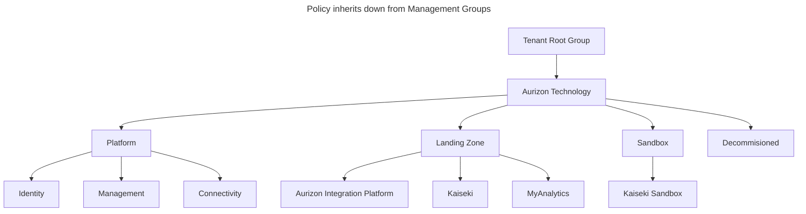

# Azure Governance

[][1]
[][4]

This repository contains governance infrastructure as code (IaC) deployments for Azure.
It is based on the [Cloud Adoption Framework][2].
Specifically this means:

- **Management Group hierarchy** &mdash; provides structure for the purpose of policy and permission inheritance.
  Apart from automated deployments most permissions will be applied using Privileged Identity Management (PIM).
- **Azure Policies** &mdash; are inherited down from management groups.
  They are used to enforce guard rails to subscriptions.
- **Subscription vending** &mdash; Subscriptions are created and assigned to the management group hierarchy, automatically inheriting the policies and permissions.

For deployment of Platform related subscriptions, please refer to the [Azure Core Platform][3] repository.

  [1]: https://github.dev/Aurizon/azure-governance
  [2]: https://learn.microsoft.com/azure/cloud-adoption-framework/ready/landing-zone/#azure-landing-zone-conceptual-architecture
  [3]: https://github.com/Aurizon/azure-core-platform
  [4]: https://codespaces.new/Aurizon/azure-governance?quickstart=1

## Getting Started

- **Pre-requisites** &mdash; Ensure you have the following installed:
  - [Visual Studio Code](https://code.visualstudio.com/)
  - [Git](https://git-scm.com/downloads)
  - Optional (extensions prompted for installation with Visual Studio Code):
    - [Azure Bicep](https://marketplace.visualstudio.com/items?itemName=ms-azuretools.vscode-bicep)
    - [PSRule](https://marketplace.visualstudio.com/items?itemName=bewhite.psrule-vscode)
  - Optional (automatically installed with GitHub Codespaces):
    - [Azure CLI](https://docs.microsoft.com/cli/azure/install-azure-cli)

## Azure Landing Zone hierarchy

The following diagram shows how Azure governance fits into the overall Azure Landing Zone hierarchy.

## Support

TBA

## Contributing

TBA
